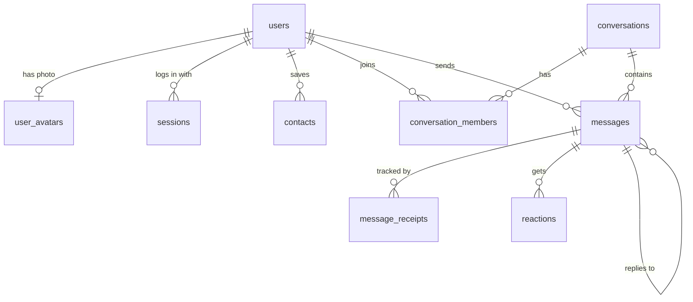

# Signal Clone

A web clone of Signal Desktop: one-on-one and group messaging in real time, with
delivery and read receipts, typing indicators, presence, reactions, replies and a
light and dark theme. Built for the Scaler SDE Fullstack assignment.

- **Live demo:** _added after deployment_
- **Repository:** https://github.com/Drishti84/Signal-Clone-Drishti

## Try it in a minute

1. Open the demo and click any name under **Demo accounts**. No password or code is needed.
2. Open the demo again in a private window (or another browser) and pick a different person.
3. Open the chat between the two and type. Messages, typing indicators and the
   check marks update live on both sides.

To register a new account, enter any phone number and use the code **123456**.

> The backend runs on a free hosting tier that sleeps when idle. The first request
> after a quiet period can take up to a minute; the login screen says so while it waits.

## Features

**Core**

| Area | What works |
|---|---|
| Onboarding | Phone number + mocked OTP, display name, avatar (colour, preset icon or uploaded photo), login, logout, session kept across reloads |
| Chat list | Sorted by latest activity, last-message preview, unread badges, timestamps, search across chats and people, unread filter |
| Contacts | Add or remove contacts, find someone by phone number, start a chat with any registered user |
| Direct messages | Real-time delivery, timestamps, typing indicator, sending → sent → delivered → read, retry for failed sends |
| Groups | Create with a name and members, live messages, member list, admin-only add / remove / rename / promote / demote, leave group, system lines such as "Asha added Rohan" |
| Presence | Online dot and "last seen", driven by real socket connections |
| Signal look and feel | Nav rail, two-pane layout, grouped bubbles, day dividers, unread divider, modals, toasts, settings |

**Bonus**

- Emoji reactions (one per person per message, replace or remove)
- Reply with a quoted message; clicking the quote jumps to the original
- Dark mode (System / Light / Dark), remembered per device

**Placeholders ("Coming soon")**

Voice and video calls, stories, linked devices, attachments, and the Privacy and
Notifications settings. End-to-end encryption is simulated: the app shows Signal's
encryption notice, but messages are stored as plain text.

## Tech stack

| Layer | Choice |
|---|---|
| Frontend | Next.js 16 (App Router), TypeScript (strict), Tailwind CSS v4, Zustand, lucide-react |
| Backend | Python, FastAPI, SQLAlchemy 2, Pydantic v2 |
| Database | SQLite |
| Real-time | WebSocket (one connection per browser tab) |
| Tests | pytest (84 backend tests) |
| Hosting | Vercel (frontend), Render (backend) |

## Architecture

```
Browser (Next.js)
   |  HTTPS  REST  /api/...        every action and query
   |  WSS    /ws?token=...         events pushed by the server, typing
   v
FastAPI (single process)
   routers  ->  services  ->  models (SQLAlchemy)  ->  SQLite
                   |
                   +-- returns Event objects --> ConnectionManager --> open sockets
```

**One rule shapes the whole design:** the client changes things through REST and
hears about other people's changes through the WebSocket. The only frames a client
sends over the socket are typing notifications and heartbeats, because those are
transient and never stored.

**Backend layers**

- `routers/` parse the request, call a service, commit, and shape the reply. They contain no rules.
- `services/` hold every rule (who may remove a member, how a status is worked out). They write
  to the database and *return* the list of events that should be broadcast.
- `realtime/` holds the `ConnectionManager` (user id → open sockets) that delivers those events.
- `models/` are the tables; `schemas/` are the request and response shapes.

Because services return events instead of sending them, every rule can be tested
without a network or a socket.

**Frontend layers**

- `lib/` has the typed API client, the self-reconnecting socket, and pure helpers
  (timestamps, bubble grouping, image resizing).
- `store/` has small Zustand stores: auth, conversations, messages, presence, contacts, UI.
- `store/events.ts` is the single entry point for socket events. Each event calls the
  same store action a REST response would, so there is one code path for "a message arrived".
- `components/` are the screens and pieces, grouped by area.

### How a message travels

1. The sender's browser shows the bubble immediately as **sending** and POSTs it with a
   `client_id` (a UUID it generated).
2. The server saves the message and one receipt row per recipient. Recipients who are
   online are marked delivered straight away. The reply turns the bubble into **sent** or **delivered**.
3. Every member's open sockets get `message.new`.
4. A recipient who was offline is marked delivered when they next connect, and the sender is told.
5. When a recipient has the chat open in a focused window, the client reports it as read;
   the sender's checks become **read**.

In a group, a message counts as delivered or read only when *every* recipient has
received or read it. If a send fails, "Retry" re-posts the same `client_id`, and the
server returns the message it already has, so a retry can never create a duplicate.

## Project structure

```
backend/
  app/
    main.py          app setup, CORS, error handler, startup seed
    config.py        settings from environment variables
    database.py      engine and session
    models/          tables
    schemas/         request / response models
    services/        business rules
    routers/         HTTP and WebSocket endpoints
    realtime/        Event and ConnectionManager
    seed.py          demo data
  tests/             pytest suite
frontend/
  src/
    app/             routes: /login and /
    components/      auth, chat, conversations, dialogs, nav, profile, providers, ui
    lib/             api, socket, formatting, grouping, types
    store/           Zustand stores and the socket event handler
render.yaml          Render blueprint for the backend
```

## Database schema



Every table has an integer primary key `id` and a `created_at` timestamp (UTC).
Foreign keys are enforced.

| Table | Columns | Notes |
|---|---|---|
| `users` | `phone` (unique, E.164), `display_name`, `about`, `avatar_color`, `avatar_preset`, `avatar_version`, `is_demo`, `last_seen_at` | `display_name` is empty until onboarding finishes |
| `user_avatars` | `user_id` (PK, FK), `content_type`, `data` (blob) | One optional photo per user |
| `sessions` | `user_id` (FK), `token` (unique), `expires_at` | One row per login; expires after 30 days |
| `contacts` | `owner_id` (FK), `contact_id` (FK) | Unique per pair; one-directional, as in Signal |
| `conversations` | `type` (`direct`/`group`), `name`, `avatar_color`, `created_by` (FK), `direct_key` (unique), `last_message_at` (indexed) | |
| `conversation_members` | `conversation_id` (FK), `user_id` (FK), `role` (`admin`/`member`), `last_read_message_id` (FK), `joined_at` | Unique per (conversation, user) |
| `messages` | `conversation_id` (FK), `sender_id` (FK, null for system lines), `type` (`text`/`system`), `body`, `reply_to_id` (FK), `client_id` | Indexed on (conversation, id); unique on (sender, client_id) |
| `message_receipts` | `message_id` (FK), `user_id` (FK), `delivered_at`, `read_at` | Unique per (message, user) |
| `reactions` | `message_id` (FK), `user_id` (FK), `emoji` | Unique per (message, user) |

**Design decisions worth explaining**

- **`conversations.direct_key`** stores `"<lowerUserId>:<higherUserId>"` for direct chats with a
  unique constraint. The database itself guarantees there is exactly one direct chat per pair,
  and finding it is a single indexed lookup. Groups leave it empty.
- **Direct and group chats share one table.** A direct chat is a conversation with two members,
  so messages, receipts, reactions and unread counts use one code path for both.
- **`message_receipts` has one row per recipient**, not a single status column on the message.
  That is what makes group receipts possible: the status shown to the sender is derived
  (`sent` → `delivered` when every row has `delivered_at` → `read` when every row has `read_at`).
- **`conversation_members.last_read_message_id`** makes an unread count a simple count of
  messages after the marker, with no per-message bookkeeping, and the marker only moves forward.
- **`messages.client_id`** with a unique constraint per sender makes sending idempotent.
- **`user_avatars` is a separate table** with the image bytes loaded lazily, so listing users
  never reads image data. `users.avatar_version` goes into the image URL, so browsers can cache
  a photo forever and still pick up a new one immediately.
- **System messages** ("Asha created the group") are rows in `messages` with `type = system`,
  so they sort and paginate with everything else, but they have no receipts and never count as unread.

## API overview

Base path `/api`. Everything except the first three auth routes and the avatar image needs
`Authorization: Bearer <token>`. Errors are `{ "detail": "..." }`. Interactive documentation is
served at `/docs` on the backend.

**Auth and profile**

| Method | Path | Purpose |
|---|---|---|
| POST | `/auth/request-otp` | Start login; reports whether the number is registered |
| POST | `/auth/verify-otp` | Check the code; returns a session token and the user |
| GET | `/auth/demo-users` | Seeded accounts for one-click login |
| POST | `/auth/logout` | End the current session |
| GET / PATCH | `/users/me` | Read or update my profile |
| PUT / DELETE | `/users/me/avatar` | Upload or remove my photo |
| GET | `/users/{id}/avatar` | A user's photo |
| GET | `/users?q=` | Search registered users |
| GET | `/users/lookup?phone=` | Find one user by phone number |

**Contacts**

| Method | Path | Purpose |
|---|---|---|
| GET | `/contacts` | My contacts |
| POST | `/contacts` | Add by `phone` or `user_id` |
| DELETE | `/contacts/{user_id}` | Remove a contact |

**Conversations**

| Method | Path | Purpose |
|---|---|---|
| GET | `/conversations` | My chats, newest first, with last message and unread count |
| POST | `/conversations/direct` | Open (or create) the direct chat with a user |
| POST | `/conversations/group` | Create a group; the creator becomes admin |
| GET | `/conversations/{id}` | Details and members |
| PATCH | `/conversations/{id}` | Rename a group (admin) |
| POST | `/conversations/{id}/members` | Add members (admin) |
| DELETE | `/conversations/{id}/members/{user_id}` | Remove a member (admin) or leave (yourself) |
| PATCH | `/conversations/{id}/members/{user_id}` | Promote or demote (admin) |
| POST | `/conversations/{id}/read` | Mark read up to a message |

**Messages**

| Method | Path | Purpose |
|---|---|---|
| GET | `/conversations/{id}/messages?before=&limit=` | One page of history, oldest first |
| POST | `/conversations/{id}/messages` | Send (`body`, `client_id`, optional `reply_to_id`) |
| PUT / DELETE | `/messages/{id}/reaction` | Set or remove my reaction |

**WebSocket** `/ws?token=<session token>`. Frames are `{ "type": ..., "data": ... }`.

| Server → client | When |
|---|---|
| `message.new` | A message was saved |
| `message.status` | A message of mine became delivered or read |
| `message.reaction` | A reaction was set or removed |
| `conversation.new` / `conversation.updated` / `conversation.removed` | A group was created, changed, or I was removed |
| `conversation.read` | Another of my tabs read a chat |
| `typing` | Someone started or stopped typing |
| `presence` | Someone went online or offline |
| `user.updated` | Someone changed their name or avatar |

| Client → server | Purpose |
|---|---|
| `typing.start` / `typing.stop` | Relayed to the other members; never stored |
| `ping` | Heartbeat every 25 seconds; the server answers `pong` |

## Running it locally

You need Python 3.11 or newer and Node.js 20 or newer.

**Backend**

```bash
cd backend
python -m venv .venv
# Windows: .venv\Scripts\activate      macOS / Linux: source .venv/bin/activate
pip install -r requirements.txt
uvicorn app.main:app --reload --port 8000
```

The first start creates `backend/signal.db` and fills it with demo data. Delete that file
to reset. Run the tests with `pytest`.

**Frontend**

```bash
cd frontend
npm install
cp .env.example .env.local
npm run dev
```

Open http://localhost:3000.

**Environment variables**

| Where | Name | Default | Purpose |
|---|---|---|---|
| Backend | `DATABASE_URL` | `sqlite:///./signal.db` | Database location |
| Backend | `CORS_ORIGINS` | `http://localhost:3000` | Comma-separated frontend origins |
| Backend | `SEED_ON_STARTUP` | `true` | Seed demo data when the database is empty |
| Backend | `DEFAULT_COUNTRY_CODE` | `+91` | Added to bare 10-digit numbers |
| Frontend | `NEXT_PUBLIC_API_URL` | `http://localhost:8000` | Backend address |
| Frontend | `NEXT_PUBLIC_WS_URL` | derived from the API URL | WebSocket address |

## Deployment

- **Backend (Render):** create a Blueprint from this repository; `render.yaml` describes the
  service. Set `CORS_ORIGINS` to the frontend's URL.
- **Frontend (Vercel):** import the repository with `frontend` as the root directory and set
  `NEXT_PUBLIC_API_URL` (and `NEXT_PUBLIC_WS_URL` with `wss://`) to the Render URL.

## Seed data

On first start the backend creates 8 demo users, 6 direct chats, 3 groups and about 150
messages spread over recent days, including replies, reactions, system lines and a mix of
read, delivered and unsent states, so every badge and check mark has something to show.

## Assumptions and limitations

- **OTP is mocked.** No SMS is sent; the code is always `123456`.
- **Encryption is simulated.** Messages are stored and sent as plain text over HTTPS / WSS.
- **The hosted demo resets.** Render's free tier has no persistent disk, so the SQLite file is
  recreated and re-seeded whenever the service restarts or wakes from sleep. Messages persist
  for as long as it stays up. Run locally, the database file persists normally.
- **One backend process.** Open sockets are tracked in memory. Running several instances
  would need a shared message bus (for example Redis pub/sub) between them.
- **Desktop layout only.** The UI follows Signal Desktop and expects a window at least 900 px wide.
- **A bare 10-digit number is treated as Indian** (`+91`). Other countries need the country code.
- **A group message is "read" only when everyone has read it**, and a person removed from a
  group loses access to it entirely.
- **Avatar photos** are cropped to a square and shrunk to 256 × 256 in the browser, and are
  limited to 256 KB.

## What I would add next

Attachments, functional disappearing messages, a mobile layout, keyboard shortcuts, message
editing and deletion, and a persistent database with a shared pub/sub layer for multiple
backend instances.
